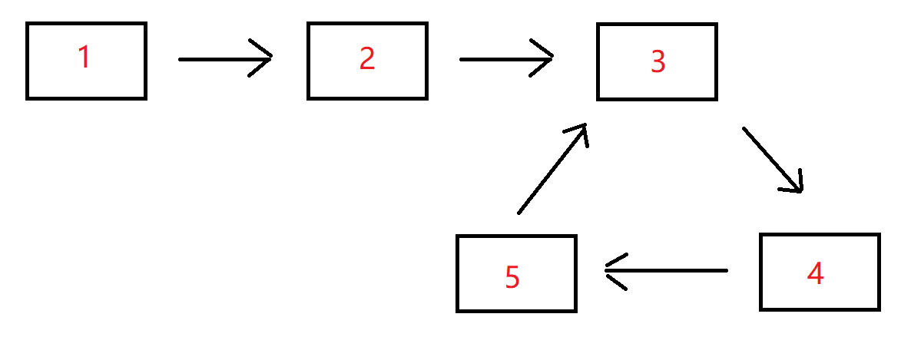
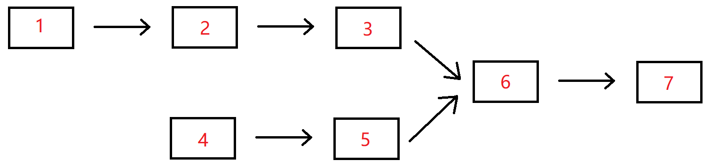
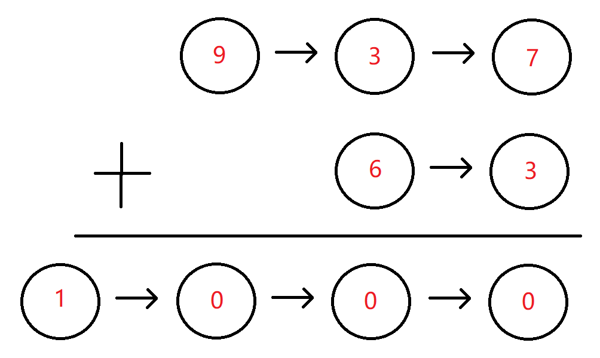

# 单向链表

## 题目

### 1. 反转链表

##### 描述

给定一个单链表的头结点pHead(该头节点是有值的，比如在下图，它的val是1)，长度为n，反转该链表后，返回新链表的表头。

数据范围： 0 ≤ n ≤ 1000 

要求：空间复杂度 o(1) ，时间复杂度 o(n)

如当输入链表{1,2,3}时，
经反转后，原链表变为{3,2,1}，所以对应的输出为{3,2,1}。
以上转换过程如下图所示：


##### 题解

```typescript
/*class ListNode {
 *     val: number
 *     next: ListNode | null
 *     constructor(val?: number, next?: ListNode | null) {
 *         this.val = (val===undefined ? 0 : val)
 *         this.next = (next===undefined ? null : next)
 *     }
 * }
 */

/**
 * @param head ListNode类 
 * @return ListNode类
 */
export function ReverseList(head: ListNode): ListNode {
    // 初始化双指针
    let cur: ListNode = head;
    let pre: ListNode  = null;

    while (cur !== null) {
        // 暂存下一个节点， 防止处理当前节点的时候断链，找不到下一个节点
        let temp = cur.next;
                
        // 反转节点
        cur.next = pre;

        // 指针后移，处理下一个节点    
        pre = cur;
        cur = temp;
    }

    // 循环结束, pre 指向新列表的表头
    return pre;
}
```


### 2. 链表内指定区间反转

##### 描述

将一个节点数为 size 链表 m 位置到 n 位置之间的区间反转，要求时间复杂度 O(n)，空间复杂度 O(1)。

例如：
    
给出的链表为 1 → 2 → 3 → 4 → 5 → NULL，m=2，n=4，

返回 1 → 4 → 3 → 2 → 5 → NULL。


数据范围：链表长度 0 < size ≤ 1000, 0 < m ≤ n ≤ size, 链表中每个节点的值满足 ∣val∣≤1000

要求：时间复杂度 O(n) ，空间复杂度 O(n)

进阶：时间复杂度 O(n) ，空间复杂度 O(1)

- **示例 1**

```text
输入：{1,2,3,4,5},2,4
返回值：{1,4,3,2,5}
```
- **示例 2**

```text
输入：{5},1,1
返回值：{5}
```

- **示例 3**

```text
输入：{1,2,3,4},1,4
返回值：{4,3,2,1}
```

##### 题解

```typescript
class ListNode {
    val: number
    next: ListNode | null
    constructor(val?: number, next?: ListNode | null) {
        this.val = (val===undefined ? 0 : val)
        this.next = (next===undefined ? null : next)
    }
 }
 
/**
 * 
 * @param head ListNode类 
 * @param m int整型 
 * @param n int整型 
 * @return ListNode类
 */
export function reverseBetween(head: ListNode, m: number, n: number): ListNode {

     // 1. 引入哨兵节点，统一处理 m=1 从头开始反转的边界情况
    let dummy = new ListNode();
    dummy.next = head;

    let pre = dummy;
  
    for (let i = 1; i < m; i += 1) {
        pre = pre.next;
    }


    let cur = pre.next

    for (let i = m; i < n; i += 1) {
        let temp = cur.next;
        cur.next = temp.next;
        temp.next = pre.next;
        pre.next = temp;
    }


    return dummy.next;
}
```

### 3. 链表中的节点每k个一组翻转

##### 描述

将给出的链表中的节点每 k 个一组翻转，返回翻转后的链表
如果链表中的节点数不是 k 的倍数，将最后剩下的节点保持原样
你不能更改节点中的值，只能更改节点本身。

数据范围： 0 ≤ n ≤ 2000，1 ≤ k ≤ 2000， 1 ≤ k ≤ 2000 ，链表中每个元素都满足 0 ≤ val ≤ 1000

要求：空间复杂度 O(1) ，时间复杂度 O(n)

例如：

给定的链表是 1 → 2 → 3 → 4 → 5

对于 k = 2 , 你应该返回 2 → 1 → 4 → 3 → 5

对于 k = 3 , 你应该返回 3 → 2 → 1 → 4 → 5

- **示例 1**
```
输入：{1,2,3,4,5},2
返回值：{2,1,4,3,5}
```

- **示例 2**
```
输入：{},1
{}
```

##### 题解


```typescript
class ListNode {
    val: number
    next: ListNode | null
    constructor(val?: number, next?: ListNode | null) {
        this.val = (val===undefined ? 0 : val)
        this.next = (next===undefined ? null : next)
    }
}

function reverse(head) {
    let pre = null;
    let cur = head;

    while(cur) {
        const nextNode = cur.next;
        cur.next = pre;

        pre = cur;
        cur = nextNode;
    }

    return pre
}

/**
 * 
 * @param head ListNode类 
 * @param k int整型 
 * @return ListNode类
 */
export function reverseKGroup(head: ListNode, k: number): ListNode {
    // 1. 边界判断
    if (!head || k === 1) return head;

    // 2. 添加哨兵节点
    const dummy = new ListNode(-1);
    dummy.next = head

    // 3. 分组拆分和分组翻转
    let preGroupEnd = dummy; // 记录上一个分组的尾节点（分组前置需要挂载的节点）
    

    while(preGroupEnd.next !== null) { // 如果上一个分组的尾节点没有下一个节点了，说明分组结束
        // 3.1 开始分组， 尝试向后走 k 个节点
        let end = preGroupEnd;
        for (let i = 0; i < k && end !== null; i += 1) {
            end = end.next;
        }
        if (!end) break; // 如果end为空，则代表当前分组不够k个节点
    
    
        // 3.2 准备翻转，记录翻转前节点
        const start = preGroupEnd.next;
        const nextGroupStart = end.next;

        // 3.3 断开分组的尾部连接，进行翻转
        end.next = null;
        reverse(start);

        // 3.3 翻转结束后，把翻转后的链表重新链接回去
        preGroupEnd.next = end; // 此时end是翻转链表的表头
        start.next = nextGroupStart // 此时start是翻转后链表的表尾

        // 3.4 为下一轮翻转重置指针
        preGroupEnd = start
    } 


    // 4. 返回结果
    return dummy.next
}
```


### 4. 合并两个排序的链表

##### 描述

输入两个递增的链表，单个链表的长度为n，合并这两个链表并使新链表中的节点仍然是递增排序的。

数据范围： 0 ≤ n ≤ 1000，−1000≤节点值≤1000

要求：空间复杂度 O(1) ，时间复杂度 O(n)

如输入{1,3,5},{2,4,6}时，合并后的链表为{1,2,3,4,5,6}，所以对应的输出为{1,2,3,4,5,6}，转换过程如下图所示：


或输入{-1,2,4},{1,3,4}时，合并后的链表为{-1,1,2,3,4,4}，所以对应的输出为{-1,1,2,3,4,4}，转换过程如下图所示：


- **示例 1**
```
输入：{1,3,5},{2,4,6}
返回值：{1,2,3,4,5,6}
```

- **示例 2**
```text
输入：{},{}
返回值：{}
```

- **示例 3**
```text
输入：{-1,2,4},{1,3,4}
返回值：{-1,1,2,3,4,4}
```

##### 题解

```typescript
class ListNode {
    val: number
    next: ListNode | null
    constructor(val?: number, next?: ListNode | null) {
        this.val = (val===undefined ? 0 : val)
        this.next = (next===undefined ? null : next)
    }
}
 
/**
 * 
 * @param pHead1 ListNode类 
 * @param pHead2 ListNode类 
 * @return ListNode类
 */
export function Merge(pHead1: ListNode, pHead2: ListNode): ListNode {
    
    // 1. 创建一个新的空链表，存储合并后空链表
    const dummy = new ListNode(0);
    let current = dummy;

    // 2. 依次比较两个链表的节点
    while (pHead1 !== null && pHead2 !== null ) {
        
        if (pHead1.val <= pHead2.val) {            
            current.next = pHead1;
            pHead1 = pHead1.next;
        } else {
            current.next = pHead2;
            pHead2 = pHead2.next;
        }
        current = current.next;
    }

    // 3. 两个链表长度不一样，比较完成后，可能还有剩余的节点，把剩余的节点挂载到新的链表上
    if (pHead1) {
        current.next = pHead1;
    } else {
        current.next = pHead2;
    }

    return dummy.next;
}
```

### 5. 合并k个已排序的链表 

##### 描述

##### 题解

1. **分治法（归并排序思想）**：将 K 个链表两两合并，类似归并排序。
2. **堆/优先队列法（Min-Heap）**：维护一个大小为 K 的最小堆，每次弹出最小的节点。

在 JS 中，由于原生没有内置的堆（Heap）数据结构（手写一个堆会增加代码量），分治法是最优雅、最推荐的解法，它不需要任何第三方库，纯靠指针移动就能达到完美的复杂度，空间复杂度也极低。


###### 分治法

分治法的核心思想是：把大问题化成小问题。
- 假设我们要合并 4 个链表：[L1, L2, L3, L4]
- 第一轮：两两合并，L1 和 L2 合并成 L12，L3 和 L4 合并成 L34。现在剩下 2 个链表 [L12, L34]。
- 第二轮：把 L12 和 L34 合并成最终的 L1234。

这就把“合并 k 个链表”降维成了我们非常熟悉的“合并 2 个升序链表”。

```typescript
class ListNode {
    val: number
    next: ListNode | null
    constructor(val?: number, next?: ListNode | null) {
        this.val = (val===undefined ? 0 : val)
        this.next = (next===undefined ? null : next)
    }
}


// 合并两个链表
function mergeTwoList(L1, L2) {
    // 1. 创建一个新的链表，存储合并结果
    const dummy = new ListNode(0);
    let cur = dummy; // 指针指向最后一个节点，方便挂载

    // 2. 依次对比L1 和 L2 两个链表的值，直到某一个列表比较完成
    while(L1 !== null && L2 !== null) {
        if (L1.val <= L2.val) {
            cur.next = L1;
            L1 = L1.next;
        } else {
            cur.next = L2;
            L2 = L2.next;
        }

        // 2.1 挂载值之后，cur向后移动
        cur = cur.next;
    }
    
    // 3. 把未比较完的列表的剩余值挂载到新链表上。
    if (L1) {
        cur.next = L1;
    } else {
        cur.next = L2;
    }

    return dummy.next;
}

// 使用分治法合并多个链表，两两合并
function divideMergeList(lists, left, right) {
    // 1. 只有一个列表时，不需要合并，直接返回
    if (left === right) return lists[left];

    const mid = Math.floor((left + right) / 2);
    const l1 = divideMergeList(lists, left, mid);
    const l2 = divideMergeList(lists, mid + 1, right);

    return mergeTwoList(l1, l2);
}


/**
 * 
 * @param lists ListNode类一维数组 
 * @return ListNode类
 */
export function mergeKLists(lists: ListNode[]): ListNode {
    // 1. 判断数组是否是空
    if (!lists.length) return null;

    return divideMergeList(lists, 0, lists.length -1);
}
```

### 6. 判断链表中是否有环

##### 描述

判断给定的链表中是否有环。如果有环则返回true，否则返回false。

数据范围：链表长度 0≤ n ≤ 10000，链表中任意节点的值满足∣val∣<=100000

要求：空间复杂度 O(1)，时间复杂度 O(n)

输入分为两部分，第一部分为链表，第二部分代表是否有环，然后将组成的head头结点传入到函数里面。-1代表无环，其它的数字代表有环，这些参数解释仅仅是为了方便读者自测调试。实际在编程时读入的是链表的头节点。

例如输入{3,2,0,-4},1时，对应的链表结构如下图所示：


可以看出环的入口结点为从头结点开始的第1个结点（注：头结点为第0个结点），所以输出true。

- **示例 1**
```text
输入：{3,2,0,-4},1
返回值：true
说明：第一部分{3,2,0,-4}代表一个链表，第二部分的1表示，-4到位置1（注：头结点为
      位置0），即-4->2存在一个链接，组成传入的head为一个带环的链表，返回true
```

- **示例 2**
```text
输入：{1},-1
返回值：false
说明：第一部分{1}代表一个链表，-1代表无环，组成传入head为一个无环的单链表，返回false    
```

- **示例 3**
```text
输入：{-1,-7,7,-4,19,6,-9,-5,-2,-5},6
返回值：true
```
##### 题解

```typescript 
/*class ListNode {
 *     val: number
 *     next: ListNode | null
 *     constructor(val?: number, next?: ListNode | null) {
 *         this.val = (val===undefined ? 0 : val)
 *         this.next = (next===undefined ? null : next)
 *     }
 * }
 */
/**
 * 
 * @param head ListNode类 
 * @return bool布尔型
 */
export function hasCycle(head: ListNode): boolean {
    // 1. 处理边界，当只有一个节点的时候，肯定不存在环的
    if (!head || !head.next) return false;
   
    // 2. 使用快慢指针是否存在闭环
    let slow = head;
    let fast = head;
    // 因为快指针永远比慢指针快，所以只需要判断快指针就够了
    while(fast !== null && fast.next !== null) {
        // 2.1 指针向后走，慢指针每次只走一步，快指针每次向后走两步
        slow = slow.next; 
        fast = fast.next.next;

        if (slow === fast) {
            return true
        } 
    }
    
    // 3. 如果跳出了循环，说明快指针触底了，链表无环
    return false;
}
```

### 7. 链表中环的入口结点

##### 描述

给一个长度为n链表，若其中包含环，请找出该链表的环的入口结点，否则，返回null。


数据范围：n ≤ 10000，1 <= 结点值 <= 10000
要求：空间复杂度 O(1)，时间复杂度 O(n)

例如，输入{1,2},{3,4,5}时，对应的环形链表如下图所示：



可以看到环的入口结点的结点值为3，所以返回结点值为3的结点。

**输入描述：**
输入分为2段，第一段是入环前的链表部分，第二段是链表环的部分，后台会根据第二段是否为空将这两段组装成一个无环或者有环单链表

**返回值描述：**
返回链表的环的入口结点即可，我们后台程序会打印这个结点对应的结点值；若没有，则返回对应编程语言的空结点即可。

- **示例 1**
```
输入：{1,2},{3,4,5}
返回值：3
说明：返回环形链表入口结点，我们后台程序会打印该环形链表入口结点对应的结点值，即3   
```

- **示例 2**
```
输入：{1,2},{3,4,5}
返回值：3
说明：返回环形链表入口结点，我们后台程序会打印该环形链表入口结点对应的结点值，即3   
```

##### 题解

```typescript
/*class ListNode {
 *     val: number
 *     next: ListNode | null
 *     constructor(val?: number, next?: ListNode | null) {
 *         this.val = (val===undefined ? 0 : val)
 *         this.next = (next===undefined ? null : next)
 *     }
 * }
 */
/**

 *
 * 
 * @param pHead ListNode类 
 * @return ListNode类
 */
export function EntryNodeOfLoop(pHead: ListNode): ListNode {
    // 1. 处理边界， 如果只有一个节点则不存在环
    if (!pHead || !pHead.next) return null;  

    // 2. 使用快慢指针判断是否存在环
    let fast = pHead;
    let slow = pHead;
    let hasCircle = false;

    while(fast !== null && fast.next !== null) {
        // 2.1 慢指针每次走一步，快指针每次走两步
        slow = slow.next;
        fast = fast.next.next;

        // 2.2 如果快慢指针相遇，说明存在环
        if (fast === slow) {
            hasCircle = true;
            break
        }
    }

    // 3. 如果不存在环则没有入口
    if (!hasCircle) return null

    // 4. 如果存在环，则利用“数学推导出来的结果”，重置头，并找出入口
    fast = pHead;
    while(fast !== slow) {
        fast = fast.next;
        slow = slow.next;
    }

    return fast;
}

```

### 8.  链表中倒数最后k个结点

##### 描述

输入一个长度为 n 的链表，设链表中的元素的值为 ai ，返回该链表中倒数第k个节点。
如果该链表长度小于k，请返回一个长度为 0 的链表。

数据范围：$0 ≤ n ≤ 10^5$，$0 ≤ a~i ≤10^9$，$0 ≤ k ≤ 10^9$

要求：空间复杂度 $O(n)$，时间复杂度 $O(n)$

要求：空间复杂度 $O(1)$，时间复杂度 $O(n)$

例如输入{1,2,3,4,5},2时，对应的链表结构如下图所示：


其中蓝色部分为该链表的最后2个结点，所以返回倒数第2个结点（也即结点值为4的结点）即可，系统会打印后面所有的节点来比较。

- **示例 1**
```text
输入：{1,2,3,4,5},2
返回值：{4,5}
说明：返回倒数第2个节点4，系统会打印后面所有的节点来比较。 
```

- **示例 2**
```text
输入：{2},8
返回值：{} 
```

##### 题解

这道题的解题方式有两种

1. **暴力破解法：** 寻找倒数第 $k$ 个节点，最直观的想法是先遍历一遍算总长度 $n$，再遍历第二遍走 $n - k$ 步。但这需要遍历两遍。
2. **双指针法：** 只需要让两个指针保持固定距离 $k$，只需要遍历一次，就可以找到倒数第 $k$ 个节点。

###### 双指针法

```typescript
/*class ListNode {
 *     val: number
 *     next: ListNode | null
 *     constructor(val?: number, next?: ListNode | null) {
 *         this.val = (val===undefined ? 0 : val)
 *         this.next = (next===undefined ? null : next)
 *     }
 * }
 */
/**
 * 
 * @param pHead ListNode类 
 * @param k int整型 
 * @return ListNode类
 */
export function FindKthToTail(pHead: ListNode, k: number): ListNode {
    // 1. 处理参数边界
    if (!pHead || k <= 0) return null;

    // 2. 定义快指针和慢指针
    let fast = pHead;
    let slow = pHead;

    // 3. 让快指针先走 k 步, 
    for (let i = 0; i < k; i +=1) {
        if (fast === null) {
            return null;
        }
        fast = fast.next;
    }

    // 4. 快指针和慢指针同步往后走，当快指针为null时，slow刚好走到了倒数k的位置
    while (fast !== null) {
        fast = fast.next;
        slow = slow.next;
    }

    return slow;
}
```

### 9. 删除链表的倒数第n个节点

##### 描述

给定一个链表，删除链表的倒数第 n 个节点并返回链表的头指针

例如，

给出的链表为:  $1 → 2 → 3 → 4 → 5$,  $n=2$。

删除了链表的倒数第 $n$ 个节点之后,链表变为 $1 → 2 → 3 → 5$。

数据范围：$0≤ n ≤1000$，链表中任意节点的值满足：$0 ≤ val ≤ 100$
要求：空间复杂度 $O(1)$，时间复杂度 $O(n)$

备注：题目保证 $n$ 一定是有效的。

- **示例 1**
```text
输入：{1,2},2
返回值：{2}
```


##### 题解

这道题和前一题是思路是一样的，只不过这次我们找到不是倒数第 $n$ 个节点，而是倒数第 $n+1$ 个节点，然后删除它。

需要注意的是：这里保证了 $n$ 一定是有效的，所以不用考虑边界问题。

```typescript
/*class ListNode {
 *     val: number
 *     next: ListNode | null
 *     constructor(val?: number, next?: ListNode | null) {
 *         this.val = (val===undefined ? 0 : val)
 *         this.next = (next===undefined ? null : next)
 *     }
 * }
 */
/**
 * 
 * @param head ListNode类 
 * @param n int整型 
 * @return ListNode类
 */
export function removeNthFromEnd(head: ListNode, n: number): ListNode {
    // 1. 判断参数边界
    if (!head || n <= 0 ) return head;

    // 2. 创建一个哨兵节点
    const dummy = new ListNode(-1);
    dummy.next = head

    let fast = dummy;
    let slow = dummy;

    for (let i = 0; i <= n; i += 1 ) {
        fast = fast.next; 
    }


    while( fast !== null) {
        fast = fast.next;
        slow = slow.next;
    }

    // 3. 此时slow是倒数第n + 1 个节点，删除第n个节点就好了
    slow.next = slow.next.next;

    return dummy.next;
}
```

### 10. 两个链表的第一个公共结点

##### 描述

输入两个无环的单向链表，找出它们的第一个公共结点，如果没有公共节点则返回空。（注意因为传入数据是链表，所以错误测试数据的提示是用其他方式显示的，保证传入数据是正确的）

数据范围：$n ≤ 1000$

要求：空间复杂度 $O(1)$，时间复杂度 $O(n)$

例如，输入{1,2,3},{4,5},{6,7}时，两个无环的单向链表的结构如下图所示：



可以看到它们的第一个公共结点的结点值为6，所以返回结点值为6的结点。

**输入描述：**

输入分为是3段，第一段是第一个链表的非公共部分，第二段是第二个链表的非公共部分，第三段是第一个链表和第二个链表的公共部分。 后台会将这3个参数组装为两个链表，并将这两个链表对应的头节点传入到函数FindFirstCommonNode里面，用户得到的输入只有pHead1和pHead2。

**返回值描述：**

返回传入的pHead1和pHead2的第一个公共结点，后台会打印以该节点为头节点的链表。

- **示例1**

```text
输入：{1,2,3},{4,5},{6,7}
返回值：{6,7}
说明：第一个参数{1,2,3}代表是第一个链表非公共部分，第二个参数{4,5}代表是第二个链
      表非公共部分，最后的{6,7}表示的是2个链表的公共部分
      这3个参数最后在后台会组装成为2个两个无环的单链表，且是有公共节点的      
```

- **示例2**

```
输入：{1},{2,3},{}
返回值：{}
说明：2个链表没有公共节点 ,返回null，后台打印{}    
```

##### 题解

```typescript
/*class ListNode {
 *     val: number
 *     next: ListNode | null
 *     constructor(val?: number, next?: ListNode | null) {
 *         this.val = (val===undefined ? 0 : val)
 *         this.next = (next===undefined ? null : next)
 *     }
 * }
 */
/**
 * 
 * @param pHead1 ListNode类 
 * @param pHead2 ListNode类 
 * @return ListNode类
 */
export function FindFirstCommonNode(pHead1: ListNode, pHead2: ListNode): ListNode {
    // 1. 处理数据的输入边界
    if (!pHead1 || !pHead2) return null;

    let pA = pHead1;
    let pB = pHead2;

    while(pA !== pB) {
        pA = (pA === null) ? pHead2 : pA.next;
        pB = (pB === null) ? pHead1 : pB.next;
    }

    return pA;
}
```

### 11. 链表相加

##### 描述

假设链表中每一个节点的值都在 0 - 9 之间，那么链表整体就可以代表一个整数。


给定两个这种链表，请生成代表两个整数相加值的结果链表。
数据范围：$0 ≤ n,m ≤ 1000000$，链表任意值 $0 ≤ val ≤ 9$
要求：空间复杂度 $O(n)$, 时间复杂度 $O(n)$

例如：链表 1 为 9 -> 3 -> 7，链表 2 为 6 -> 3，最后生成新的结果链表为 1 -> 0 -> 0 -> 0。



- **示例 1**
```text
输入：{9,3,7},{6,3}
返回值：{1,0,0,0}
```

- **示例 2**
```text
输入：[0],[6,3]
返回值：{6,3}
```

##### 题解

题目中，链表的最高位在表头（比如 9 -> 3 -> 7 代表 937）。但是我们在做加法时，必须从个位（表尾）开始相加，并且还要处理进位（carry）。

由于单向链表不能从后往前遍历，要解决这个问题，我们有两种主流且优雅的方案：
1. **栈（Stack）方案**：利用栈“先进后出”的特性，把链表节点依次压入栈中，然后再弹出来相加。
2. **反转链表（Reverse）方案**：先对两个输入链表进行反转，从低位加到高位，算出结果后再反转回来。

因为题目给出的空间复杂度要求是 $O(n)$，使用栈方案最直观且不需要修改原链表的结构。

###### 栈方案

**使用双栈法解题目**

1. **入栈**：创建两个栈 stack1 和 stack2，分别遍历两个链表，把所有节点的值依次压入对应的栈中。
2. **弹出与相加**：开启一个循环，只要两个栈中还有元素，或者还有上一次剩下的进位 carry，就继续循环。
    - 每次从栈顶弹出数字（代表当前最低位）。
    - 将弹出的数字与进位 `carry` 相加，算出当前位的总和 `sum`。
3. *构建结果链表（头插法）*：当前位的值为 `sum % 10`，新的进位为 `Math.floor(sum / 10)`。
    - **关键点**：为了让结果链表保持“高位在前”的顺序，我们应该采用头插法来构建新链表。即每次创建新节点后，让它指向当前的结果链表头部。

**为什么不使用数字相加呢？**

在实际的计算机底层和算法面试中，这条路是完全走不通的。最根本的原因只有四个字：大数溢出。

题目给出的数据范围是：$0 <= n,m <= 1000000$ 这意味着，链表的长度最大可以是 100万位！

**代码实现**

```typescript
/*class ListNode {
 *     val: number
 *     next: ListNode | null
 *     constructor(val?: number, next?: ListNode | null) {
 *         this.val = (val===undefined ? 0 : val)
 *         this.next = (next===undefined ? null : next)
 *     }
 * }
 */
/**
 * 
 * @param head1 ListNode类 
 * @param head2 ListNode类 
 * @return ListNode类
 */
export function addInList(head1: ListNode, head2: ListNode): ListNode {

    // 1. 创建两个栈
    const stack1 = [];
    const stack2 = [];

    // 2. 把链表转换为栈
    let p1 = head1;
    while(p1 !== null) {
        stack1.push(p1.val);
        p1 = p1.next
    }

    let p2 = head2;
    while(p2 !== null) {
        stack2.push(p2.val);
        p2 = p2.next;
    }

    // 3. 进行计算
    let resHead= null // 存储计算结果
    let carry = 0;  // 存储进位
    while(stack1.length || stack2.length || carry > 0) {
        // 3.1 取出栈中的值
        const num1 = stack1.length > 0 ? stack1.pop() : 0;
        const num2 = stack2.length > 0 ? stack2.pop() : 0;


        // 3.2 计算进位和值
        const sum = num1 + num2 + carry;
        carry = Math.floor(sum / 10);
        const val = sum % 10;

        // 3.3 把值放入链表节点中，然后挂载到新链表中(头插法)
        const node = new ListNode(val);
        node.next = resHead;    
        resHead = node;  
    }

    return resHead;
}
```

### 12. 单链表的排序

##### 描述

给定一个节点数为n的无序单链表，对其按升序排序。

数据范围：$0< n ≤ 100000$，保证节点权值在 $[−10^9,10^9]$ 之内。

要求：空间复杂度 $O(n)$ 时间复杂度 $O(nlogn)$

- **示例 1**
```text
输入：[1,3,2,4,5]
返回值：{1,2,3,4,5}
```

- **示例 2**
```text
输入：[-1,0,-2]
返回值：{-2,-1,0}
```

##### 题解

```typescript
/*class ListNode {
 *     val: number
 *     next: ListNode | null
 *     constructor(val?: number, next?: ListNode | null) {
 *         this.val = (val===undefined ? 0 : val)
 *         this.next = (next===undefined ? null : next)
 *     }
 * }
 */
/**
 * 
 * @param head ListNode类 the head node
 * @return ListNode类
 */
export function sortInList(head: ListNode): ListNode {
    
    // 1. 把链表转换成数据
    let arr = [];
    let cur = head;
    while(cur !==null ) {
        arr.push(cur.val);
        cur = cur.next;
    }

    // 2. 使用数组从大到小排序
    arr = arr.sort((a, b) => a - b);

    // 3. 把值重新填到链表中
    cur = head;
    for(let i = 0; i < arr.length; i += 1) {
        cur.val = arr[i];
        cur = cur.next;
    }

    return head;
}
```


### 13. 判断一个链表是否为回文结构

##### 描述

给定一个链表，请判断该链表是否为回文结构。

回文是指该字符串正序逆序完全一致。

数据范围： 链表节点数 $0 ≤ n ≤ 10^5$, 链表中每个节点的值满足 $∣val∣≤ 10^7$
 

- **示例 1**
```text
输入：{1}
返回值：true
```

- **示例 2**
```text
输入：{2,1}
返回值：false
说明：2->1
```

- **示例 3**
```text
输入：{1,2,2,1}
返回值：true
说明：1->2->2->1   
```

##### 题解

```typescript

/*class ListNode {
 *     val: number
 *     next: ListNode | null
 *     constructor(val?: number, next?: ListNode | null) {
 *         this.val = (val===undefined ? 0 : val)
 *         this.next = (next===undefined ? null : next)
 *     }
 * }
 */
/**
 * 
 * @param head ListNode类 the head
 * @return bool布尔型
 */
export function isPail(head: ListNode): boolean {
    // 1. 判断边界
    if (!head || !head.next) return true;

    // 2.将链表转化为数组
    const arr = [];
    let cur = head;
    while(cur) {
        arr.push(cur.val)
        cur = cur.next;
    }

    // 3.使用数组判断是否回文
    let left = 0;
    let right = arr.length - 1;
    while(left < right) {
        if (arr[left] !== arr[right]) {
            return false;
        }
        left += 1;
        right -= 1;
    } 
    return true;
}
```


### 14. 链表的奇偶重排


##### 描述

给定一个单链表，请设定一个函数，将链表的奇数位节点和偶数位节点分别放在一起，重排后输出。

注意是节点的编号而非节点的数值。

数据范围：节点数量满足 $0 ≤ n ≤ 10^5$，节点中的值都满足 $0 ≤ val ≤ 1000$。
要求：空间复杂度 $O(n)$，时间复杂度 $O(n)$

- **示例1**
```text
输入：{1,2,3,4,5,6}
返回值：{1,3,5,2,4,6}
说明：1->2->3->4->5->6->NULL
      重排后为 1->3->5->2->4->6->NULL
```

- **示例2**
```text
输入：{1,4,6,3,7}
返回值：{1,6,7,4,3}
说明：1->4->6->3->7->NULL 
      重排后为 1->6->7->4->3->NULL
      奇数位节点有1,6,7，偶数位节点有4,3。重排后为1,6,7,4,3
备注：链表长度不大于200000。每个数范围均在int内。
```

##### 题解

```typescript
/*class ListNode {
 *     val: number
 *     next: ListNode | null
 *     constructor(val?: number, next?: ListNode | null) {
 *         this.val = (val===undefined ? 0 : val)
 *         this.next = (next===undefined ? null : next)
 *     }
 * }
 */
/**
 * 
 * @param head ListNode类 
 * @return ListNode类
 */
export function oddEvenList(head: ListNode): ListNode {
    // write code here

    let jiHead = new ListNode(-1);
    let ouHead = new ListNode(-1);


    let jiCur = jiHead;
    let ouCur = ouHead;
    let cur = head
    let isJiShu = true;
    while(cur !== null) {
        if (isJiShu) {
            jiCur.next = cur;
            jiCur = jiCur.next;
            isJiShu = false;
        } else {
            ouCur.next = cur;
            ouCur = ouCur.next;
            isJiShu = true;
        }
        cur = cur.next;
    }


    ouCur.next = null;
    jiCur.next = ouHead.next;


    return jiHead.next;    
}
```

### 15.  删除有序链表中重复的元素-1

##### 描述
删除给出链表中的重复元素（链表中元素从小到大有序），使链表中的所有元素都只出现一次

例如：

给出的链表为 1 → 1 → 2,返回 1 → 2。

给出的链表为 1 → 1 → 2 → 3 → 3,返回 1→2→3。

数据范围：链表长度满足 $0 ≤ n ≤ 100$，链表中任意节点的值满足 $∣val∣≤100$。

进阶：空间复杂度 $O(1)$，时间复杂度 $O(n)$


- **示例 1**
```text
输入：{1,1,2}
返回值：{1,2}
```
- **示例 2**
```text
输入：{}
返回值：{}
```

##### 题解

这道题其实是有个隐藏条件的：由于链表已经从小到大有序，相同的重复元素一定会紧紧挨在一起。这让去重变得非常简单。

**代码实现**

```typescript
/*class ListNode {
 *     val: number
 *     next: ListNode | null
 *     constructor(val?: number, next?: ListNode | null) {
 *         this.val = (val===undefined ? 0 : val)
 *         this.next = (next===undefined ? null : next)
 *     }
 * }
 */
/**
 * 
 * @param head ListNode类 
 * @return ListNode类
 */
export function deleteDuplicates(head: ListNode): ListNode {
    // 1. 单个元素不可能有重复
    if (!head || !head.next) return head;


    // 2. 开始去重
    let cur = head;
    while(cur !== null && cur.next !== null) {
        if (cur.val === cur.next.val) {
            // 当元素值重复时，去掉该元素
            cur.next = cur.next.next;
        } else {
            // 当元素不重复时，处理下一个元素
            cur = cur.next;
        }
    }

    return head;
}
```


### 15.  删除有序链表中重复的元素-2

##### 描述

给出一个升序排序的链表，删除链表中的所有重复出现的元素，只保留原链表中只出现一次的元素。
例如：
给出的链表为 1→2→3→3→4→4→5, 返回1→2→5.
给出的链表为 1→1→1→2→3, 返回2→3.

数据范围：链表长度 0≤n≤10000，链表中的值满足 ∣val∣≤1000
要求：空间复杂度 O(n)，时间复杂度 O(n)
进阶：空间复杂度 O(1)，时间复杂度 O(n)

- **示例 1**
```text
输入：{1,2,2}
返回值：{1}
```

- **示例 2**
```text
输入：{}
返回值：{}
```

##### 题解

```typescript
/*class ListNode {
 *     val: number
 *     next: ListNode | null
 *     constructor(val?: number, next?: ListNode | null) {
 *         this.val = (val===undefined ? 0 : val)
 *         this.next = (next===undefined ? null : next)
 *     }
 * }
 */
/**
 * 
 * @param head ListNode类 
 * @return ListNode类
 */
export function deleteDuplicates(head: ListNode): ListNode {
    // 1. 处理边界
    if(!head || !head.next) return head;

    // 2. 创建守卫节点，因为头节点可能会被删除
    let dummy = new ListNode(-1);
    dummy.next = head; 
    let cur = dummy;

    // 3. 开始删除重复节点
    // 遍历列表，必须确保有两个元素能比较
    while(cur.next !== null && cur.next.next !== null) {
        if (cur.next.val === cur.next.next.val) {
            const duplicVal = cur.next.val;

            while(cur.next && cur.next.val === duplicVal) {
                cur.next = cur.next.next
            }
        } else {
            cur = cur.next;
        }
    }

    return dummy.next;
}
```


## 总结

1. 穿针引线法
2. 快慢指针法
3. 


### 快慢指针法

快慢指针法，也被形象地称为“龟兔赛跑算法”。

###### 算法原理

想象一下，乌龟和兔子在操场上跑步：
- 如果操场是一条直线跑道，兔子跑得快，肯定会先到达终点，它们永远不会相遇。
- 如果操场是一个环形跑道，兔子跑得快，在绕圈跑的过程中，兔子一定会从后面“套圈”乌龟，它们必然会在某个点相遇。

**算法映射**

1. 定义两个指针，`slow`（慢指针/乌龟）和 `fast`（快指针/兔子），初始都指向链表头节点 `head`。

2. 开启循环，`slow` 每次只往前走 1 步（`slow = slow.next`），`fast` 每次往前走 2 步（`fast = fast.next.next`）。

3. 如果链表有环，快指针最终会进入环并在环内绕圈，由于它每次比慢指针多走一步，它们一定会相遇（`slow === fast`）。

4. 如果链表无环，快指针会率先走到终点（遇到 `null`），此时直接返回 `false`。

#### 判断链表是否有环

#### 找到环的入口节点

我们不仅要判断链表是否有环，还要精准定位到环的入口节点。

我们依然使用快慢指针，但在相遇之后，需要加入一个非常奇妙的数学推导结论。

**数学推导：为什么相遇后能找到入口？**

为了让你清晰地理解这个算法的原理，我们把链表分成三段：

- 从头节点到环入口的距离设为 $a$。
- 从环入口到快慢指针相遇点的距离设为 $b$。
- 从相遇点继续往前走回到环入口的距离设为 $c$。

此时，环的总长度就是 $b + c$。

```text
       a (非环部分)       b (相遇点)
Header -----------> 入口 -------> 相遇点
                     ^             |
                     |             | c
                     +-------------+
```

当快慢指针在相遇点碰面时：
- 慢指针（slow）走过的总总距离为：$L_{slow} = a + b$
- 快指针（fast）走过的总总距离为：$L_{fast} = a + b + n(b + c)$ （其中 $n$ 是快指针在环里转的圈数）

因为快指针的速度是慢指针的 2 倍，所以快指针走过的距离一定是慢指针的 2 倍：

$$
L_{fast} = 2L_{slow}
$$

化简这个方程：

$$
a + b + n(b + c) = 2a + 2b
$$

$$
n(b + c) = a + b
$$

$$
a = n(b + c) - b
$$

为了看得更清楚，我们从 $n(b+c)$ 中借出一圈（即 $b+c$）展开：

$$
a = (n - 1)(b + c) + (b + c) - b
$$

$$
a = (n - 1)(b + c) + c
$$

**这个公式告诉了我们什么？**

$a$（从头节点到入口的距离），等于 $c$（从相遇点到入口的距离） 加上 $n-1$ 圈的环长。

这意味着：如果我们在快慢指针相遇时，把其中一个指针重新放回链表头部（Header），然后两个指针都以每次 1 步的速度同时往前走。当从头出发的指针走了 $a$ 步到达入口时，留在环里的那个指针刚好走了 $c$ 步（外加完整的几圈），它们必定会在环的入口处完美相遇！


#### 寻找倒数k个结点

1. 快指针先行：让快指针 `fast` 先往前走 $k$ 步。此时，`fast` 和头节点 `slow` 之间的距离正好是 $k$。
2. 边界拦截：如果在快指针走这 $k$ 步的过程中，链表就提早结束了（即 `fast` === null，且没走满 $k$  步），说明链表总长度小于 $k$。按照题目要求，直接返回 null（或者空链表）。
3. 双指针齐头并进：当 `fast` 成功领先 $k$ 步后，让 `slow` 和 `fast` 同时每次往前走 1 步。
4. 锁定目标：当 `fast` 走到链表的尽头（变为 `null`）时，因为两个指针之间永远卡着 $k$ 的物理距离，此时 `slow` 指针刚好停在倒数第 $k$ 个节点上。

### 等长拼接法

等长拼接法，也有个优雅的名字“浪漫相遇法”。

###### 算法原理

两个链表如果有公共节点，那么从第一个公共节点开始，到链表末尾的这一段是完全重合（共享）的。它们不相同的地方，在于公共节点之前的非重合部分长度可能不同。

```text
链表 A:    a1 → a2 ↘
                     c1 → c2 → c3 (公共部分)
链表 B: b1 → b2 → b3 ↗
```
- 假设链表 A 的非公共部分长度为 $a$，公共部分长度为 $c$。总长度为 $a + c$。
- 假设链表 B 的非公共部分长度为 $b$，公共部分长度为 $c$。总长度为 $b + c$。

由于 $a$ 和 $b$ 通常不相等，我们让两个指针分别从 A 和 B 的头节点出发，速度相同。如果它们只走自己的链表，因为长度差，它们无法同时到达公共节点。

💡 绝妙的解决方案：

让两个指针把对方走过的路也走一遍！
- 指针 `pA` 走完链表 A 之后，去走链表 B。
- 指针 `pB` 走完链表 B 之后，去走链表 A。

当它们在第二阶段相遇时：
- 指针 `pA` 走过的总总总距离是：$a + c + b$
- 指针 `pB` 走过的总总总距离是：$b + c + a$

因为 $a + c + b = b + c + a$，它们走过的总距离完全相等！这意味着，只要两个链表有公共节点，它们必然会同时指向第一个公共节点。

**如果两个链表没有公共节点呢？**

没有公共节点相当于 $c = 0$。它们分别走完 $a + b$ 和 $b + a$ 的距离后，会同时变成 `null`，此时 pA === pB（都为 `null`），循环结束，正好返回 `null`。


### 哨兵节点法

**什么是哨兵节点？**

哨兵节点是链表最前面我们自己创建的一个“虚拟头节点”，它的特点是：

1. 不存储任何业务数据，
2. 永远固定在链表最前面，
3. 它的 next 指针永远指向链表，

它的核心作用只有一个：让链表操作永远“有前驱可依”，消除头节点的特殊性，让所有节点的操作都统一起来。

举个例子，在


**什么时候用哨兵节点？**

当你的操作涉及 “可能修改头节点”或“需要统一处理所有节点” 时，必须用哨兵节点。典型场景包括：

1.头结点可能会被删除。
2.头结点可能会被移动。
3.需要统一插入/删除/查找的逻辑。


