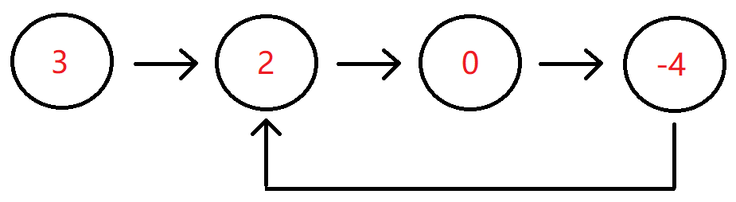

# 单向链表

## 题目

##### 1. 反转链表

<br/>

###### 描述

给定一个单链表的头结点pHead(该头节点是有值的，比如在下图，它的val是1)，长度为n，反转该链表后，返回新链表的表头。

数据范围： 0 ≤ n ≤ 1000 

要求：空间复杂度 o(1) ，时间复杂度 o(n)

如当输入链表{1,2,3}时，
经反转后，原链表变为{3,2,1}，所以对应的输出为{3,2,1}。
以上转换过程如下图所示：


###### 解题思路

###### 代码实现

```typescript
/*class ListNode {
 *     val: number
 *     next: ListNode | null
 *     constructor(val?: number, next?: ListNode | null) {
 *         this.val = (val===undefined ? 0 : val)
 *         this.next = (next===undefined ? null : next)
 *     }
 * }
 */

/**
 * 代码中的类名、方法名、参数名已经指定，请勿修改，直接返回方法规定的值即可
 * @param head ListNode类 
 * @return ListNode类
 */
export function ReverseList(head: ListNode): ListNode {
    // 初始化双指针
    let cur: ListNode = head;
    let pre: ListNode  = null;

    while (cur !== null) {
        // 暂存下一个节点， 防止处理当前节点的时候断链，找不到下一个节点
        let temp = cur.next;
                
        // 反转节点
        cur.next = pre;

        // 指针后移，处理下一个节点    
        pre = cur;
        cur = temp;
    }

    // 循环结束, pre 指向新列表的表头
    return pre;
}
```


##### 2. 链表内指定区间反转

<br/>

###### 描述

将一个节点数为 size 链表 m 位置到 n 位置之间的区间反转，要求时间复杂度 O(n)，空间复杂度 O(1)。

例如：
    
给出的链表为 1 → 2 → 3 → 4 → 5 → NULL，m=2，n=4，

返回 1 → 4 → 3 → 2 → 5 → NULL。

<br/>

数据范围：链表长度 0 < size ≤ 1000, 0 < m ≤ n ≤ size, 链表中每个节点的值满足 ∣val∣≤1000

要求：时间复杂度 O(n) ，空间复杂度 O(n)

进阶：时间复杂度 O(n) ，空间复杂度 O(1)

**示例 1**

```text
输入：{1,2,3,4,5},2,4
返回值：{1,4,3,2,5}
```
**示例 2**

```text
输入：{5},1,1
返回值：{5}
```

**示例 3**

```text
输入：{1,2,3,4},1,4
返回值：{4,3,2,1}
```

###### 代码实现

```typescript
class ListNode {
    val: number
    next: ListNode | null
    constructor(val?: number, next?: ListNode | null) {
        this.val = (val===undefined ? 0 : val)
        this.next = (next===undefined ? null : next)
    }
 }
 
/**
 * 代码中的类名、方法名、参数名已经指定，请勿修改，直接返回方法规定的值即可
 *
 * 
 * @param head ListNode类 
 * @param m int整型 
 * @param n int整型 
 * @return ListNode类
 */
export function reverseBetween(head: ListNode, m: number, n: number): ListNode {

     // 1. 引入哨兵节点，统一处理 m=1 从头开始反转的边界情况
    let dummy = new ListNode();
    dummy.next = head;

    let pre = dummy;
  
    for (let i = 1; i < m; i += 1) {
        pre = pre.next;
    }


    let cur = pre.next

    for (let i = m; i < n; i += 1) {
        let temp = cur.next;
        cur.next = temp.next;
        temp.next = pre.next;
        pre.next = temp;
    }


    return dummy.next;
}
```

##### 3. 链表中的节点每k个一组翻转

<br/>

###### 描述

将给出的链表中的节点每 k 个一组翻转，返回翻转后的链表
如果链表中的节点数不是 k 的倍数，将最后剩下的节点保持原样
你不能更改节点中的值，只能更改节点本身。

数据范围： 0 ≤ n ≤ 2000，1 ≤ k ≤ 2000， 1 ≤ k ≤ 2000 ，链表中每个元素都满足 0 ≤ val ≤ 1000

要求：空间复杂度 O(1) ，时间复杂度 O(n)

例如：

给定的链表是 1 → 2 → 3 → 4 → 5

对于 k = 2 , 你应该返回 2 → 1 → 4 → 3 → 5

对于 k = 3 , 你应该返回 3 → 2 → 1 → 4 → 5

**示例 1**
```
输入：{1,2,3,4,5},2
返回值：{2,1,4,3,5}
```

**示例 2**
```
输入：{},1
{}
```

###### 解题思路


###### 代码实现
```typescript
class ListNode {
    val: number
    next: ListNode | null
    constructor(val?: number, next?: ListNode | null) {
        this.val = (val===undefined ? 0 : val)
        this.next = (next===undefined ? null : next)
    }
}

function reverse(head) {
    let pre = null;
    let cur = head;

    while(cur) {
        const nextNode = cur.next;
        cur.next = pre;

        pre = cur;
        cur = nextNode;
    }

    return pre
}

/**
 * 代码中的类名、方法名、参数名已经指定，请勿修改，直接返回方法规定的值即可
 *
 * 
 * @param head ListNode类 
 * @param k int整型 
 * @return ListNode类
 */
export function reverseKGroup(head: ListNode, k: number): ListNode {
    // 1. 边界判断
    if (!head || k === 1) return head;

    // 2. 添加哨兵节点
    const dummy = new ListNode(-1);
    dummy.next = head

    // 3. 分组拆分和分组翻转
    let preGroupEnd = dummy; // 记录上一个分组的尾节点（分组前置需要挂载的节点）
    

    while(preGroupEnd.next !== null) { // 如果上一个分组的尾节点没有下一个节点了，说明分组结束
        // 3.1 开始分组， 尝试向后走 k 个节点
        let end = preGroupEnd;
        for (let i = 0; i < k && end !== null; i += 1) {
            end = end.next;
        }
        if (!end) break; // 如果end为空，则代表当前分组不够k个节点
    
    
        // 3.2 准备翻转，记录翻转前节点
        const start = preGroupEnd.next;
        const nextGroupStart = end.next;

        // 3.3 断开分组的尾部连接，进行翻转
        end.next = null;
        reverse(start);

        // 3.3 翻转结束后，把翻转后的链表重新链接回去
        preGroupEnd.next = end; // 此时end是翻转链表的表头
        start.next = nextGroupStart // 此时start是翻转后链表的表尾

        // 3.4 为下一轮翻转重置指针
        preGroupEnd = start
    } 


    // 4. 返回结果
    return dummy.next
}
```


##### 4. 合并两个排序的链表

<br/>

###### 描述

输入两个递增的链表，单个链表的长度为n，合并这两个链表并使新链表中的节点仍然是递增排序的。

数据范围： 0 ≤ n ≤ 1000，−1000≤节点值≤1000

要求：空间复杂度 O(1) ，时间复杂度 O(n)

如输入{1,3,5},{2,4,6}时，合并后的链表为{1,2,3,4,5,6}，所以对应的输出为{1,2,3,4,5,6}，转换过程如下图所示：


或输入{-1,2,4},{1,3,4}时，合并后的链表为{-1,1,2,3,4,4}，所以对应的输出为{-1,1,2,3,4,4}，转换过程如下图所示：


**示例 1**
```
输入：{1,3,5},{2,4,6}
返回值：{1,2,3,4,5,6}
```

**示例 2**
```text
输入：{},{}
返回值：{}
```

**示例 3**
```text
输入：{-1,2,4},{1,3,4}
返回值：{-1,1,2,3,4,4}
```

###### 代码实现

```typescript
class ListNode {
    val: number
    next: ListNode | null
    constructor(val?: number, next?: ListNode | null) {
        this.val = (val===undefined ? 0 : val)
        this.next = (next===undefined ? null : next)
    }
}
 
/**
 * 代码中的类名、方法名、参数名已经指定，请勿修改，直接返回方法规定的值即可
 *
 * 
 * @param pHead1 ListNode类 
 * @param pHead2 ListNode类 
 * @return ListNode类
 */
export function Merge(pHead1: ListNode, pHead2: ListNode): ListNode {
    
    // 1. 创建一个新的空链表，存储合并后空链表
    const dummy = new ListNode(0);
    let current = dummy;

    // 2. 依次比较两个链表的节点
    while (pHead1 !== null && pHead2 !== null ) {
        
        if (pHead1.val <= pHead2.val) {            
            current.next = pHead1;
            pHead1 = pHead1.next;
        } else {
            current.next = pHead2;
            pHead2 = pHead2.next;
        }
        current = current.next;
    }

    // 3. 两个链表长度不一样，比较完成后，可能还有剩余的节点，把剩余的节点挂载到新的链表上
    if (pHead1) {
        current.next = pHead1;
    } else {
        current.next = pHead2;
    }

    return dummy.next;
}
```

##### 5. 合并k个已排序的链表 

<br/>

###### 描述

###### 解题思路

1. **分治法（归并排序思想）**：将 K 个链表两两合并，类似归并排序。
2. **堆/优先队列法（Min-Heap）**：维护一个大小为 K 的最小堆，每次弹出最小的节点。

在 JS 中，由于原生没有内置的堆（Heap）数据结构（手写一个堆会增加代码量），分治法是最优雅、最推荐的解法，它不需要任何第三方库，纯靠指针移动就能达到完美的复杂度，空间复杂度也极低。

分治法的核心思想是：把大问题化成小问题。
- 假设我们要合并 4 个链表：[L1, L2, L3, L4]
- 第一轮：两两合并，L1 和 L2 合并成 L12，L3 和 L4 合并成 L34。现在剩下 2 个链表 [L12, L34]。
- 第二轮：把 L12 和 L34 合并成最终的 L1234。

这就把“合并 k 个链表”降维成了我们非常熟悉的“合并 2 个升序链表”。


###### 代码实现

```typescript
class ListNode {
    val: number
    next: ListNode | null
    constructor(val?: number, next?: ListNode | null) {
        this.val = (val===undefined ? 0 : val)
        this.next = (next===undefined ? null : next)
    }
}


// 合并两个链表
function mergeTwoList(L1, L2) {
    // 1. 创建一个新的链表，存储合并结果
    const dummy = new ListNode(0);
    let cur = dummy; // 指针指向最后一个节点，方便挂载

    // 2. 依次对比L1 和 L2 两个链表的值，直到某一个列表比较完成
    while(L1 !== null && L2 !== null) {
        if (L1.val <= L2.val) {
            cur.next = L1;
            L1 = L1.next;
        } else {
            cur.next = L2;
            L2 = L2.next;
        }

        // 2.1 挂载值之后，cur向后移动
        cur = cur.next;
    }
    
    // 3. 把未比较完的列表的剩余值挂载到新链表上。
    if (L1) {
        cur.next = L1;
    } else {
        cur.next = L2;
    }

    return dummy.next;
}

// 使用分治法合并多个链表，两两合并
function divideMergeList(lists, left, right) {
    // 1. 只有一个列表时，不需要合并，直接返回
    if (left === right) return lists[left];

    const mid = Math.floor((left + right) / 2);
    const l1 = divideMergeList(lists, left, mid);
    const l2 = divideMergeList(lists, mid + 1, right);

    return mergeTwoList(l1, l2);
}


/**
 * 代码中的类名、方法名、参数名已经指定，请勿修改，直接返回方法规定的值即可
 *
 * 
 * @param lists ListNode类一维数组 
 * @return ListNode类
 */
export function mergeKLists(lists: ListNode[]): ListNode {
    // 1. 判断数组是否是空
    if (!lists.length) return null;

    return divideMergeList(lists, 0, lists.length -1);
}
```

##### 6. 判断链表中是否有环

<br/>

###### 描述

判断给定的链表中是否有环。如果有环则返回true，否则返回false。

数据范围：链表长度 0≤ n ≤ 10000，链表中任意节点的值满足∣val∣<=100000

要求：空间复杂度 O(1)，时间复杂度 O(n)

输入分为两部分，第一部分为链表，第二部分代表是否有环，然后将组成的head头结点传入到函数里面。-1代表无环，其它的数字代表有环，这些参数解释仅仅是为了方便读者自测调试。实际在编程时读入的是链表的头节点。

例如输入{3,2,0,-4},1时，对应的链表结构如下图所示：



可以看出环的入口结点为从头结点开始的第1个结点（注：头结点为第0个结点），所以输出true。

- **示例 1**
```text
输入：{3,2,0,-4},1
返回值：true
说明：第一部分{3,2,0,-4}代表一个链表，第二部分的1表示，-4到位置1（注：头结点为
      位置0），即-4->2存在一个链接，组成传入的head为一个带环的链表，返回true
```
- **示例 2**
```text
输入：{1},-1
返回值：false
说明：第一部分{1}代表一个链表，-1代表无环，组成传入head为一个无环的单链表，返回false    
```
- **示例 3**
```text
输入：{-1,-7,7,-4,19,6,-9,-5,-2,-5},6
返回值：true
```
###### 代码实现

```typescript 
/*class ListNode {
 *     val: number
 *     next: ListNode | null
 *     constructor(val?: number, next?: ListNode | null) {
 *         this.val = (val===undefined ? 0 : val)
 *         this.next = (next===undefined ? null : next)
 *     }
 * }
 */
/**
 * 代码中的类名、方法名、参数名已经指定，请勿修改，直接返回方法规定的值即可
 *
 * 
 * @param head ListNode类 
 * @return bool布尔型
 */
export function hasCycle(head: ListNode): boolean {
    // 1. 处理边界，当只有一个节点的时候，肯定不存在环的
    if (!head || !head.next) return false;
   
    // 2. 使用快慢指针是否存在闭环
    let slow = head;
    let fast = head;
    // 因为快指针永远比慢指针快，所以只需要判断快指针就够了
    while(fast !== null && fast.next !== null) {
        // 2.1 指针向后走，慢指针每次只走一步，快指针每次向后走两步
        slow = slow.next; 
        fast = fast.next.next;

        if (slow === fast) {
            return true
        } 
    }
    
    // 3. 如果跳出了循环，说明快指针触底了，链表无环
    return false;
}
```


## 总结

1. 穿针引线法
2. 快慢指针法
3. 


#### 快慢指针法

快慢指针法，也被形象地称为“龟兔赛跑算法”。

**场景描述**

想象一下，乌龟和兔子在操场上跑步：
- 如果操场是一条直线跑道，兔子跑得快，肯定会先到达终点，它们永远不会相遇。
- 如果操场是一个环形跑道，兔子跑得快，在绕圈跑的过程中，兔子一定会从后面“套圈”乌龟，它们必然会在某个点相遇。

<!-- **算法映射**

1. 定义两个指针，`slow`（慢指针/乌龟）和 `fast`（快指针/兔子），初始都指向链表头节点 `head`。

2. 开启循环，`slow` 每次只往前走 1 步（`slow = slow.next`），`fast` 每次往前走 2 步（`fast = fast.next.next`）。

3. 如果链表有环，快指针最终会进入环并在环内绕圈，由于它每次比慢指针多走一步，它们一定会相遇（`slow === fast`）。

4. 如果链表无环，快指针会率先走到终点（遇到 `null`），此时直接返回 `false`。

##### 找到环的入口节点

我们不仅要判断链表是否有环，还要精准定位到环的入口节点。

我们依然使用快慢指针，但在相遇之后，需要加入一个非常奇妙的数学推导结论。

**数学推导：为什么相遇后能找到入口？** -->

<!-- 为了让你清晰地理解这个算法的原理，我们把链表分成三段：
- 从头节点到环入口的距离设为 $a$。
- 从环入口到快慢指针相遇点的距离设为 $b$。
- 从相遇点继续往前走回到环入口的距离设为 $c$。 -->


#### 哨兵节点

**什么是哨兵节点？**

哨兵节点是链表最前面我们自己创建的一个“虚拟头节点”，它的特点是：

1. 不存储任何业务数据，
2. 永远固定在链表最前面，
3. 它的 next 指针永远指向链表，

它的核心作用只有一个：让链表操作永远“有前驱可依”，消除头节点的特殊性，让所有节点的操作都统一起来。

举个例子，在


**什么时候用哨兵节点？**

当你的操作涉及 “可能修改头节点”或“需要统一处理所有节点” 时，必须用哨兵节点。典型场景包括：

1.头结点可能会被删除。
2.头结点可能会被移动。
3.需要统一插入/删除/查找的逻辑。


