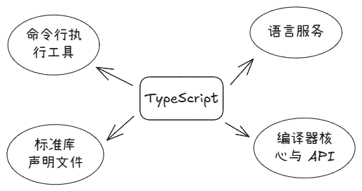

# 快速上手

## TypeScript的作用

JavaScript 自诞生起，就运行于浏览器端，最初只是用来处理一些简单的用户交互，如表单验证等操作，而不是每次都提交给服务端验证。所以它不需要设计的特别复杂，只进行了简单的类型定义。

随着浏览器性能的提升，能够满足更加复杂的交互和承载更多的业务需求，所以基于 JavaScript 开发的项目也就越来越复杂，而复杂的项目也就意味着更多的Bug:smile:。

JavaScript 作为弱类型的语言，是被解释执行的，缺少运行前的类型检查，只能在运行时检查并找到类型错误。对于中/大型项目，由类型引发的错误非常多，甚至可以说是线上 Bug 的“重灾区”，核心原因就是 js 作为弱类型语言，没有编译器的类型校验。

为了弥补 JavaScript 类型上缺失，TypeScript 诞生了:blush:！其[官网](https://www.typescriptlang.org/)中写的很明确：**TypeScript 的目标就是成为 JavaScript 的类型检查器**。你可以把它当做一门全新的语言看待，它定义了一套完整的类型系统，并在“编译期”进行类型检查，只不过它把 JavaScript 作为“编译期”的产物了。


## TypeScript的组成

个人从架构的角度，把 TypeScript 的分成了下面三个层级。


##### 语言层 

虽然 TypeScript 最终是被编译成 JavaScript 执行的，但它依然是一门全新的语言。从学习的角度来讲，存在着不小的成本。这里仅说明它有哪些特点，在后续的章节中，我们再详细深入讲解它的语法。

- 对比 Java 等强类型语言，它定义了一套完整的语法，包括变量声明、函数声明、类声明、接口声明、函数重载等。
- 它支持 JavaScript 的所有语法，所以被称为 JavaScript 的超集。也就是说，任何合法的JavaScript 代码，都是合法的 TypeScript 代码。

##### 编译器 & 工具链层： 

如果是单纯的定义语法，那 TypeScript 实际上是做不了什么的，所以必须要有与之配套的工具，才能把它实际使用起来。

- 编译器：作用是把 TypeScript 代码编译成 JavaScript 代码。
- 语言服务：提供类型推断、代码补全、代码导航、重构等功能。
- 工程配置：配置 TypeScript 项目的编译选项、输出目录、模块系统等。

##### 生态融合层

TypeScript不是用来取代JavaScript的，世界已经是 JavaScript 的了，TypeScript 必须兼容整个世界。

## 安装

我们可以通过npm安装TypeScript，并且应该作为开发依赖被安装，它的本质是“转译器”，在运行时并不存在。
  
```bash
npm install typescript --save-dev
```

“ typescript ”包，包含下面几个部分：



##### 命令行执行工具

这是 tsc 时真正运行的部分。它们通常位于 bin/ 目录下：

* `tsc` : TypeScript编译器的终端入口, 运行 `npx tsc` 或 `tsc` 时实际调用的文件。
* `tsserver` : TypeScript语言服务进程。这是IDE(如VS Code)背后的英雄，基于LSP（语言服务协议）与编辑器通信。它负责提供** 语法高亮、代码补全、实时错误提示 **。

##### 标准库声明文件

这是TypeScript内置的类型库，是类型系统的基础。ts 必须知道 js 的内置对象长什么样。

- 作用：为js内置对象（如 Array, Promise, window, Document 等）提供类型声明，无需你手动定义就可以做类型检查。
- 分类：
    - 按js版本：`lib.es5.d.ts` (ES5)、 `lib.es2015.d.ts` （ES6）、 `lib.esnext.d.ts`（最新 ES 特性）；
    - 按运行环境分：`lib.dom.d.ts` （浏览器环境）、 `lib.node.d.ts` (Node.js环境)、 `lib.webworker.d.ts` （WebWorker）；
- 使用方式： ts会根据tsconfig.json中的target和lib配置自动加载对象的 `.d.ts` 文件。（比如 `target: ES6` 会自动加载 `lib.es6.d.ts` ）.

##### 编译器核心与 API

这是整个TypeScript包的核心，这是整个包的底层逻辑实现：

- **核心内容**：包含 TS 编译的全流程逻辑 —— 词法分析、语法分析、类型检查、AST 转换、代码发射（生成 JS），以及类型系统的所有核心逻辑（类型推断、类型收窄、类型兼容性判断等）。
- **无独立拆分**：TS 的编译器逻辑被打包成一个单文件（typescript.lib.js），tsc和tsserver都会加载这个文件

##### 语言服务

这一部分是编辑器智能提示、跳转、重构的真正源头。

- **实时分析**：当你在编辑器里打字时，tsserver 会增量解析你的代码，计算语法树（AST）。
- **通信协议**：它通过 LSP (Language Server Protocol) 的变体与编辑器通信。


 