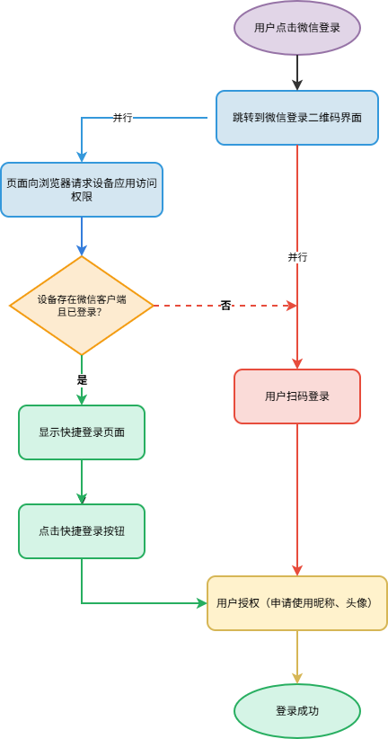
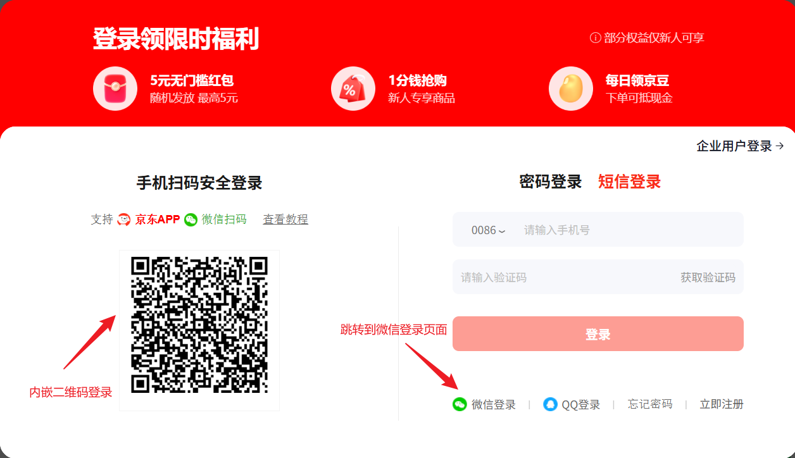
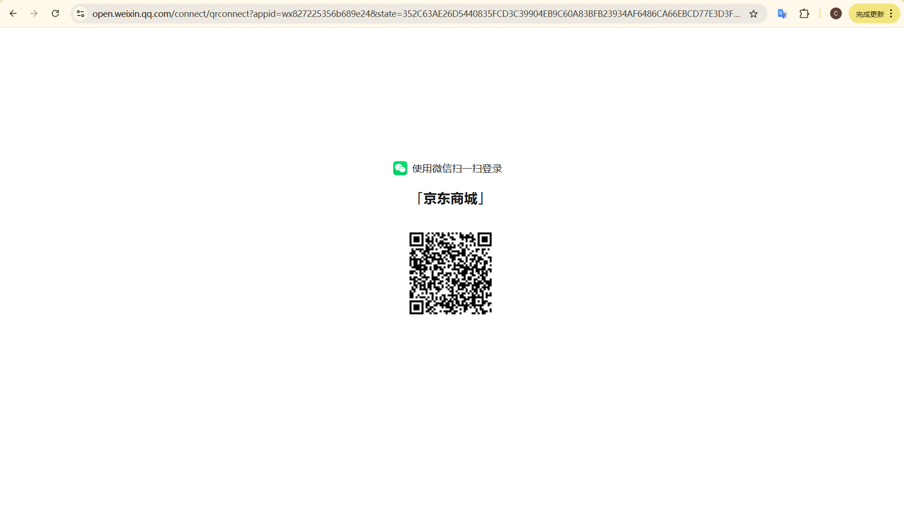
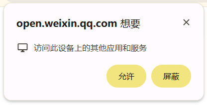
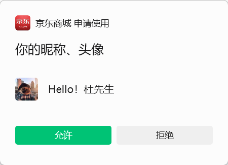
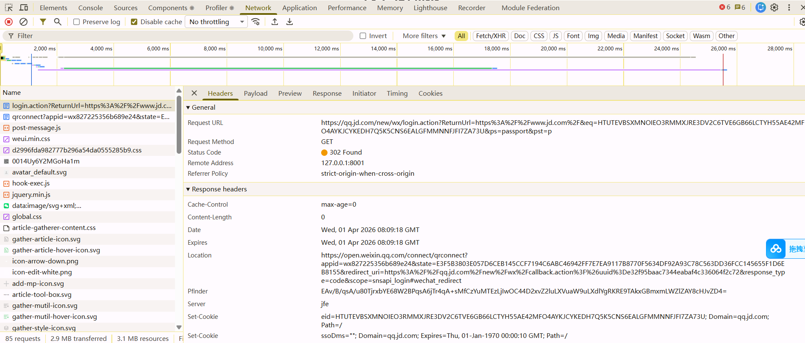
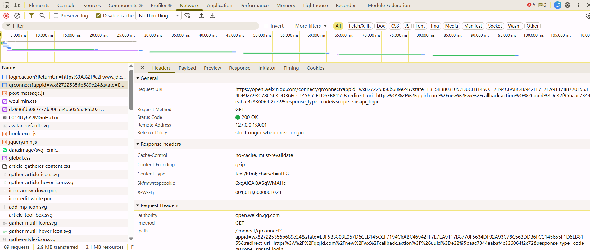

# 微信扫码登录实现

## 网页端微信扫码登录

“网页端微信扫码登录”是指当我们登录某些网站（第三方网站）时使用微信进行扫码进行登录的过程。

- 第三方网站把身份验证环节委托给微信，从而获取安全地获取用户身份。
- 通过扫码的方式进行登录，简化了登录过程。

这是**微信官方提供的能力**，[官方文档](https://developers.weixin.qq.com/doc/oplatform/developers/dev/auth/web.html)在“网站应用授权登录”开发有详细的说明。

### 使用说明

第三方网站使用这些能力是有条件的。
- 第三方网站使用通过微信扫码登录不是免费的（具体费用参考官网，目前是300元）。
- 在微信开放平台注册开发者账号，创建一个网站应用，通过审核后获得该网站相应的 `AppID` （应用标识）和 `AppSecret` （应用密钥，仅后端存储，严禁暴露前端）。

### 交互过程

下面以“京东网站”为例，说明微信扫码登录的前端交互过程。

1. 第三方网站有下面两种方式展示微信二维码。这两种方式基本上是一样的。
    - 在第三方网站的登录页面内嵌微信二维码。
    - 点击“微信登录”按钮跳转到微信扫码登录页面。

    

2. 点击“微信登录”按钮后就跳转到下面的“微信扫码登录页面”，这个页面是微信官方提供的。

    

3. “微信扫码登录页面”会向浏览器请求设备上应用的访问权限，判断当前设备是否存在**已经登录**并且处于**非锁定状态**的微信客户端。
    
    

4. 如果存在，则会优先使用已登录的账号进行快捷登录。

    

5. 无论是“快捷登录”还是“微信扫码登录”，实际上都是一次授权的过程。

    

6. 用户同意了第三方网站的授权后，第三方网站会收到微信的授权回调通知，然后就可以获取到用户的微信身份信息，从而实现登录。

### 实现流程解析

其实整个流程的实现并不复杂，微信官方为了身份校验过程标准化、防止敏感信息泄露、规范登录过程中的会话管理、降低第三方网站开发成本，尽可能的将整个登录过程进行封装，从而便于开发者对接。

从业务的角度来讲，整个登录过程涉及到 3 个核心角色：微信用户、第三方网站应用、微信开放平台（微信服务器）。

 

但是从开发的角度来讲，则整个流程涉及到 4 个节点：用户手机客户端、浏览器（第三方网站-前端和微信前端）、第三方网站应用-后端、微信服务器。

核心交互链路：网页前端发起登录请求 → 网站后端重定向到微信登录页面（展示二维码） → 网页前端展示二维码 → 用户手机微信扫码 → 手机微信解析二维码信息并向微信服务器发起授权请求 → 用户确认授权 → 微信服务器同步授权信息给网站后端 → 网站后端生成登录态并通知网页前端 → 网页端完成登录。

下面我们拆解一下整个登录流程，依然以“京东”为例。

1. 点击“微信登录”按钮后，会向网站后端发送一个“获取微信登录二维码”的请求（无敏感信息，仅告知后端“需要生成登录二维码”）。

2. 上面的请求状态通常是 `302`, 会被重定向到微信官方的“二维码获取”请求，该请求返回的是“二维码登录页面”。

    该请求携带参数说明如下：
    -  `appid`: 应用标识，与“开放平台”注册一致。
    - `redirect_uri`: 回调 `url`, 与“开放平台”注册一致。

## 扫描小程序码登录

“扫描小程序码”不是官方提供的标准登录方式，“微信开放平台”为网站应用提供的唯一官方标准扫码登录是“网站应用微信登录”。

该方案是基于“小程序码生成”、“小程序登录”、“开放平台 UnionID” 打通这三类官方能力的组合实现。

## 扫描公众号码登录